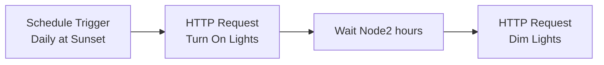

# n8n MCP Integration - Complete Setup Guide

## Table of Contents
1. [Prerequisites](#prerequisites)
2. [Initial Setup](#initial-setup)
3. [Creating Credentials](#creating-credentials)
4. [Building Your First Workflow](#building-your-first-workflow)
5. [Common Workflow Patterns](#common-workflow-patterns)
6. [Advanced Examples](#advanced-examples)
7. [Troubleshooting](#troubleshooting)

## Prerequisites

Before starting, ensure you have:

- ✅ Home Assistant MCP Server running (port 4000)
- ✅ n8n instance running and accessible
- ✅ Home Assistant long-lived access token
- ✅ Network connectivity between n8n and MCP server

## Initial Setup

### Step 1: Verify MCP Server is Running

First, verify your MCP server is accessible:

```bash
curl -X GET http://YOUR_SERVER_IP:4000/mcp/health
```

Expected response:
```json
{
  "status": "ok",
  "transport": "http",
  "protocol": "mcp",
  "version": "0.1.0",
  "toolCount": 11
}
```

### Step 2: Test Authentication

Test your Home Assistant token:

```bash
curl -X GET http://YOUR_SERVER_IP:4000/mcp/tools \
  -H "Authorization: Bearer YOUR_HASS_TOKEN"
```

## Creating Credentials

### Step 1: Create HTTP Header Auth Credential

1. In n8n, go to **Credentials** → **New**
2. Select **Header Auth** as the credential type
3. Configure:
   - **Name**: `Home Assistant MCP Token`
   - **Header Name**: `Authorization`
   - **Header Value**: `Bearer YOUR_HASS_TOKEN`
4. Click **Save**

### Step 2: Store Server URL (Optional)

For reusability, create an n8n variable:

1. Go to **Settings** → **Variables**
2. Add new variable:
   - **Key**: `MCP_SERVER_URL`
   - **Value**: `http://YOUR_SERVER_IP:4000/mcp`

## Building Your First Workflow

### Basic Workflow: List All Tools

1. **Create New Workflow**
   - Name: "MCP Tool Discovery"

2. **Add HTTP Request Node**
   - **Method**: POST
   - **URL**: `http://YOUR_SERVER_IP:4000/mcp`
   - **Authentication**: Generic Credential Type → Header Auth
   - **Credential**: Select "Home Assistant MCP Token"
   - **Send Headers**: Yes
   - **Header Parameters**:
     - Name: `Content-Type`
     - Value: `application/json`
   - **Send Body**: Yes
   - **Body Content Type**: JSON
   - **JSON Body**:
     ```json
     {
       "jsonrpc": "2.0",
       "id": 1,
       "method": "tools/list",
       "params": {}
     }
     ```

3. **Add Item Lists Node** (Optional)
   - Extract tools from response
   - **Field to Split Out**: `result.tools`
   - **Include**: Selected fields
   - **Fields**: `name`, `description`

4. **Save and Execute**

### Workflow: Control a Light

1. **Create New Workflow**
   - Name: "Home Assistant Light Control"

2. **Add Manual Trigger** (for testing)

3. **Add HTTP Request Node**
   - **Node Name**: "Turn On Light"
   - **Method**: POST
   - **URL**: `{{$vars.MCP_SERVER_URL}}` (or hardcode)
   - **Authentication**: Generic Credential Type → Header Auth
   - **JSON Body**:
     ```json
     {
       "jsonrpc": "2.0",
       "id": "{{$json.id || Date.now()}}",
       "method": "tools/call",
       "params": {
         "name": "control",
         "arguments": {
           "command": "turn_on",
           "entity_id": "light.living_room",
           "brightness": 128
         }
       }
     }
     ```

## Common Workflow Patterns

### Pattern 1: Time-Based Automation

**Sunset Light Automation**



**n8n Workflow JSON:**
```json
{
  "nodes": [
    {
      "parameters": {
        "rule": {
          "interval": [
            {
              "triggerAtHour": 18,
              "triggerAtMinute": 30
            }
          ]
        }
      },
      "name": "Sunset Schedule",
      "type": "n8n-nodes-base.scheduleTrigger",
      "position": [250, 300]
    },
    {
      "parameters": {
        "url": "http://YOUR_IP:4000/mcp",
        "method": "POST",
        "authentication": "genericCredentialType",
        "genericAuthType": "httpHeaderAuth",
        "sendHeaders": true,
        "headerParameters": {
          "parameters": [
            {
              "name": "Content-Type",
              "value": "application/json"
            }
          ]
        },
        "sendBody": true,
        "bodyContentType": "json",
        "body": "{\"jsonrpc\":\"2.0\",\"id\":1,\"method\":\"tools/call\",\"params\":{\"name\":\"control\",\"arguments\":{\"command\":\"turn_on\",\"entity_id\":\"light.outdoor\"}}}"
      },
      "name": "Turn On Outdoor Lights",
      "type": "n8n-nodes-base.httpRequest",
      "position": [450, 300]
    }
  ]
}
```

### Pattern 2: Conditional Actions

**Temperature-Based Climate Control**

```javascript
// In Function Node
const temperature = $input.first().json.temperature;

if (temperature > 25) {
  return {
    json: {
      action: "cool",
      target_temp: 22
    }
  };
} else if (temperature < 18) {
  return {
    json: {
      action: "heat",
      target_temp: 20
    }
  };
}

return {
  json: {
    action: "off"
  }
};
```

### Pattern 3: Batch Operations

**Turn Off All Lights**

1. **First Node**: List all devices
2. **Filter Node**: Keep only lights that are on
3. **Loop Node**: For each light, call control tool

```json
{
  "jsonrpc": "2.0",
  "id": "{{$itemIndex}}",
  "method": "tools/call",
  "params": {
    "name": "control",
    "arguments": {
      "command": "turn_off",
      "entity_id": "{{$json.entity_id}}"
    }
  }
}
```

## Advanced Examples

### Example 1: Motion-Activated Lighting

**Workflow Components:**
1. Webhook trigger (receives motion events)
2. Check time of day
3. Turn on lights if dark
4. Wait 5 minutes
5. Turn off lights

**Complete Workflow:**

```json
{
  "nodes": [
    {
      "parameters": {
        "path": "motion-detected",
        "responseMode": "responseNode",
        "options": {}
      },
      "name": "Motion Webhook",
      "type": "n8n-nodes-base.webhook",
      "position": [250, 300]
    },
    {
      "parameters": {
        "conditions": {
          "dateTime": [
            {
              "value1": "={{$now}}",
              "operation": "after",
              "value2": "18:00"
            }
          ]
        }
      },
      "name": "Is Dark?",
      "type": "n8n-nodes-base.if",
      "position": [450, 300]
    },
    {
      "parameters": {
        "url": "http://YOUR_IP:4000/mcp",
        "method": "POST",
        "authentication": "genericCredentialType",
        "sendBody": true,
        "bodyContentType": "json",
        "body": "{\"jsonrpc\":\"2.0\",\"id\":1,\"method\":\"tools/call\",\"params\":{\"name\":\"control\",\"arguments\":{\"command\":\"turn_on\",\"entity_id\":\"{{$json.room}}.light\",\"brightness\":255}}}"
      },
      "name": "Turn On Light",
      "type": "n8n-nodes-base.httpRequest",
      "position": [650, 280]
    },
    {
      "parameters": {
        "amount": 5,
        "unit": "minutes"
      },
      "name": "Wait 5 Minutes",
      "type": "n8n-nodes-base.wait",
      "position": [850, 280]
    },
    {
      "parameters": {
        "url": "http://YOUR_IP:4000/mcp",
        "method": "POST",
        "body": "{\"jsonrpc\":\"2.0\",\"id\":2,\"method\":\"tools/call\",\"params\":{\"name\":\"control\",\"arguments\":{\"command\":\"turn_off\",\"entity_id\":\"{{$json.room}}.light\"}}}"
      },
      "name": "Turn Off Light",
      "type": "n8n-nodes-base.httpRequest",
      "position": [1050, 280]
    }
  ]
}
```

### Example 2: Morning Routine

**Trigger at 7:00 AM on weekdays:**

1. Turn on bedroom lights (dim)
2. Start coffee maker
3. Set thermostat to comfort mode
4. Play morning news on speaker

```javascript
// Function node to prepare all commands
const morningRoutine = [
  {
    tool: "control",
    args: {
      command: "turn_on",
      entity_id: "light.bedroom",
      brightness: 64
    }
  },
  {
    tool: "control",
    args: {
      command: "turn_on",
      entity_id: "switch.coffee_maker"
    }
  },
  {
    tool: "control",
    args: {
      command: "set_preset_mode",
      entity_id: "climate.thermostat",
      preset_mode: "comfort"
    }
  },
  {
    tool: "activate_scene",
    args: {
      scene_id: "scene.morning_news"
    }
  }
];

return morningRoutine.map((cmd, index) => ({
  json: {
    jsonrpc: "2.0",
    id: index + 1,
    method: "tools/call",
    params: {
      name: cmd.tool,
      arguments: cmd.args
    }
  }
}));
```

### Example 3: Energy Monitoring Alert

Monitor power consumption and alert if threshold exceeded:

```json
{
  "nodes": [
    {
      "parameters": {
        "rule": {
          "interval": [
            {
              "field": "minutes",
              "minutesInterval": 15
            }
          ]
        }
      },
      "name": "Every 15 Minutes",
      "type": "n8n-nodes-base.scheduleTrigger"
    },
    {
      "parameters": {
        "url": "http://YOUR_IP:4000/mcp",
        "method": "POST",
        "body": "{\"jsonrpc\":\"2.0\",\"id\":1,\"method\":\"tools/call\",\"params\":{\"name\":\"get_history\",\"arguments\":{\"entity_id\":\"sensor.power_consumption\",\"start_time\":\"-15m\"}}}"
      },
      "name": "Get Power Data",
      "type": "n8n-nodes-base.httpRequest"
    },
    {
      "parameters": {
        "jsCode": "const data = $input.first().json.result.content[0].text;\nconst parsed = JSON.parse(data);\nconst avgPower = parsed.reduce((sum, item) => sum + item.state, 0) / parsed.length;\n\nreturn [{json: {avgPower, alert: avgPower > 5000}}];"
      },
      "name": "Calculate Average",
      "type": "n8n-nodes-base.code"
    },
    {
      "parameters": {
        "conditions": {
          "boolean": [
            {
              "value1": "={{$json.alert}}",
              "value2": true
            }
          ]
        }
      },
      "name": "High Usage?",
      "type": "n8n-nodes-base.if"
    },
    {
      "parameters": {
        "url": "http://YOUR_IP:4000/mcp",
        "method": "POST",
        "body": "{\"jsonrpc\":\"2.0\",\"id\":2,\"method\":\"tools/call\",\"params\":{\"name\":\"send_notification\",\"arguments\":{\"message\":\"High power usage: {{$json.avgPower}}W\",\"title\":\"Energy Alert\"}}}"
      },
      "name": "Send Alert",
      "type": "n8n-nodes-base.httpRequest"
    }
  ]
}
```

## Working with Responses

### Parsing MCP Responses

Use a Code node to parse responses:

```javascript
// Parse MCP response
const response = $input.first().json;

if (response.error) {
  throw new Error(`MCP Error: ${response.error.message}`);
}

const result = response.result;

// Extract text content if present
if (result.content && result.content[0]) {
  const content = result.content[0].text;
  
  // Try to parse as JSON if possible
  try {
    return [{
      json: JSON.parse(content)
    }];
  } catch {
    return [{
      json: { text: content }
    }];
  }
}

return [{
  json: result
}];
```

### Error Handling

Add error handling to your workflows:

```javascript
// In Function node after HTTP Request
const response = $input.first().json;

if (response.error) {
  // Log error
  console.error('MCP Error:', response.error);
  
  // Decide how to handle
  switch(response.error.code) {
    case -32001: // Unauthorized
      throw new Error('Invalid token - check credentials');
    case -32601: // Method not found
      throw new Error('Invalid MCP method');
    default:
      // Continue with fallback
      return [{
        json: {
          success: false,
          error: response.error.message
        }
      }];
  }
}

// Process successful response
return [{
  json: {
    success: true,
    data: response.result
  }
}];
```

## Troubleshooting

### Common Issues

#### 1. Authentication Errors

**Error:** `{"error":{"code":-32001,"message":"Unauthorized"}}`

**Solutions:**
- Verify token is correct
- Check Authorization header format: `Bearer YOUR_TOKEN`
- Ensure no extra spaces or characters
- Test token with curl first

#### 2. Connection Refused

**Error:** `ECONNREFUSED`

**Solutions:**
- Verify MCP server is running
- Check firewall rules
- Ensure correct IP and port (4000)
- Test with `telnet YOUR_IP 4000`

#### 3. Invalid JSON-RPC Request

**Error:** `{"error":{"code":-32600,"message":"Invalid Request"}}`

**Solutions:**
- Ensure `jsonrpc: "2.0"` is included
- Verify JSON syntax
- Include required `id` field
- Check Content-Type is `application/json`

#### 4. Tool Not Found

**Error:** `{"error":{"code":-32601,"message":"Method not found"}}`

**Solutions:**
- Use `tools/list` to get available tools
- Check tool name spelling
- Verify method name (e.g., `tools/call` not `tool/call`)

### Debug Workflow

Create a debug workflow to test connection:

1. **HTTP Request**: Get health
   ```
   GET http://YOUR_IP:4000/mcp/health
   ```

2. **HTTP Request**: List tools (with auth)
   ```
   GET http://YOUR_IP:4000/mcp/tools
   Authorization: Bearer YOUR_TOKEN
   ```

3. **HTTP Request**: Initialize session
   ```json
   {
     "jsonrpc": "2.0",
     "id": 1,
     "method": "initialize",
     "params": {}
   }
   ```

4. **HTTP Request**: Simple tool call
   ```json
   {
     "jsonrpc": "2.0",
     "id": 2,
     "method": "tools/call",
     "params": {
       "name": "list_devices",
       "arguments": {}
     }
   }
   ```

### Logging and Monitoring

Add logging nodes to track execution:

```javascript
// Log node
console.log('MCP Request:', {
  timestamp: new Date().toISOString(),
  method: $json.method,
  tool: $json.params?.name,
  args: $json.params?.arguments
});

return $input.all();
```

## Best Practices

1. **Use Variables** for server URLs and common values
2. **Add Error Handling** to all HTTP requests
3. **Rate Limiting**: Add delays between bulk operations
4. **Logging**: Log all MCP interactions for debugging
5. **Testing**: Test workflows with manual trigger first
6. **Backup**: Export workflows regularly
7. **Documentation**: Comment complex logic in Code nodes

## Performance Tips

1. **Batch Operations**: Group multiple commands when possible
2. **Caching**: Store frequently used data in variables
3. **Parallel Execution**: Use Split In Batches for parallel processing
4. **Timeout Settings**: Set appropriate timeouts for HTTP requests
5. **Connection Pooling**: Reuse HTTP connections when possible

## Security Considerations

1. **Store tokens securely** in n8n credentials
2. **Use HTTPS** in production environments
3. **Limit workflow permissions** to necessary users
4. **Audit logs** for unauthorized access
5. **Regular token rotation**
6. **Network isolation** between n8n and Home Assistant

## Next Steps

- Review [MCP HTTP Transport Documentation](./MCP_HTTP_TRANSPORT.md) for protocol details
- Explore [Available MCP Tools](./N8N_MCP_INTEGRATION.md#available-mcp-tools)
- Join the community for workflow sharing
- Consider contributing your workflows back to the project

## Support

For help and support:
- Check the [Troubleshooting](#troubleshooting) section
- Review server logs: `docker logs homeassistant-mcp`
- Open an issue on GitHub
- Ask in the Home Assistant community forums